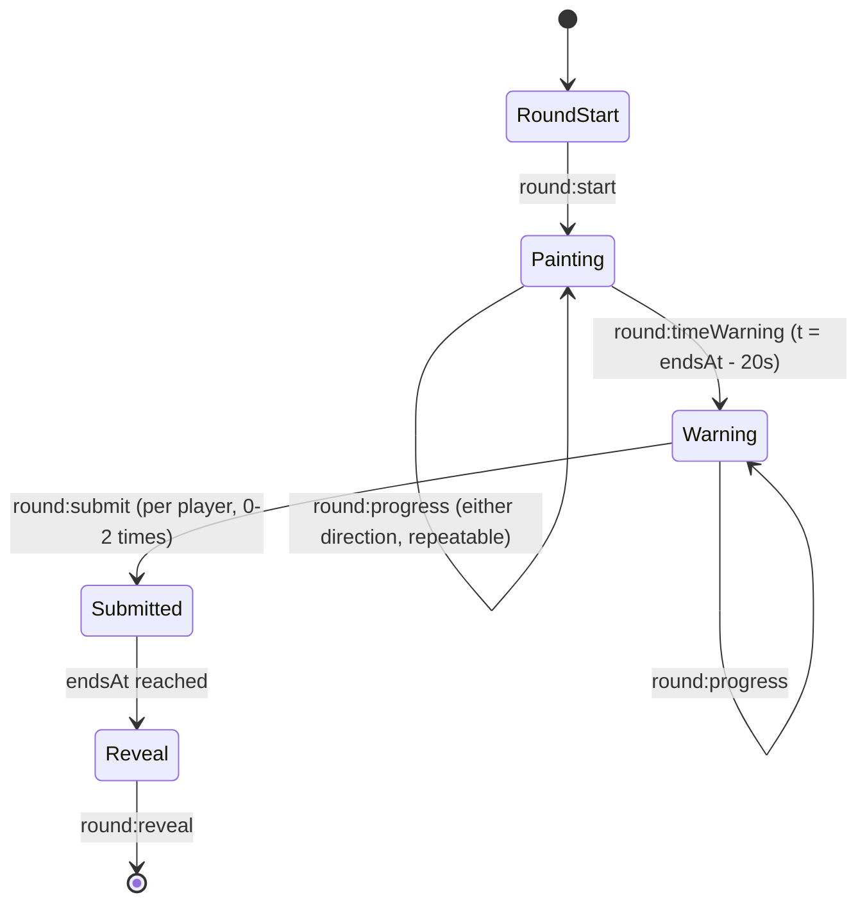
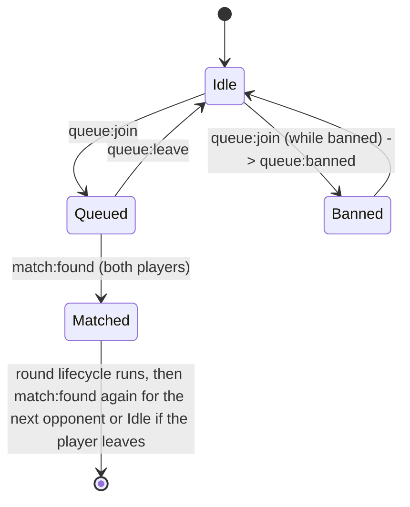
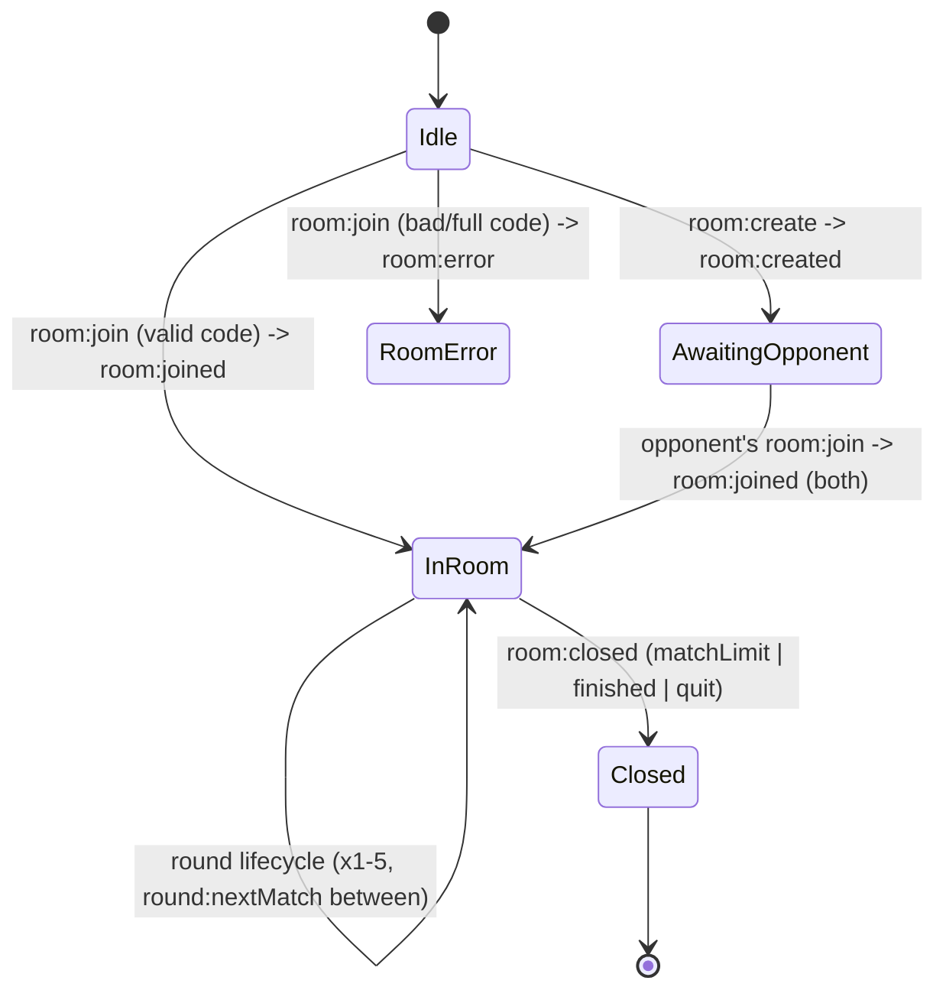
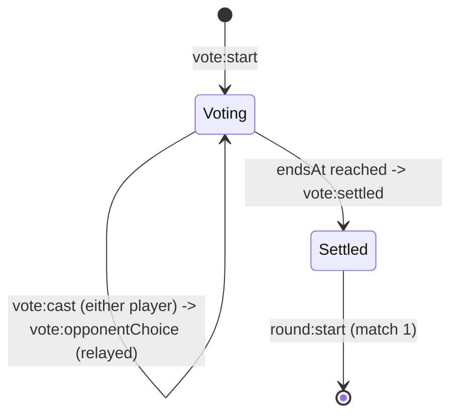

# Multiplayer WebSocket Protocol

Status: **spec only** — nothing in this repo implements it yet. This
document is the contract `backend/src/matchmaking/`, `backend/src/rooms/`,
`backend/src/ws/`, and the (not-yet-written) frontend WS client must agree
on before any of that code is written, so that both sides can be built
independently without guessing at each other's message shapes.

`frontend/` and `backend/` deliberately have no shared package/tooling
(see `AGENTS.md`), so there is no shared TypeScript module either side
imports types from. This file is that shared contract, kept in sync by
hand. Type names below (`CategoryId`, `ThemeId`, ...) refer to
`frontend/src/types.ts`; the backend never imports them, it just needs to
pass the string values through untouched.

## Transport

One `ws://` connection per player, one JSON object per text frame. Every
message is a flat object with a `type` string discriminator plus
message-specific fields — no envelope wrapper, no request/response ids.
`type` values use `namespace:event` naming (`queue:join`, `room:created`,
...) matching the namespaces below.

## Identity

There is no account system and none is planned — adding auth is out of
scope for multiplayer entirely. Instead, the client generates a
`playerId` (a `crypto.randomUUID()` v4 string) the first time it loads,
persists it in `localStorage`, and reuses it on every future visit. The
player also picks/keeps a display `name` (also persisted client-side, no
server-side uniqueness check). The very first message a client sends
after the socket opens registers both with the server:

```jsonc
// client -> server, first message on every connection
{ "type": "identify", "playerId": "3f1b2c8e-...-uuid", "name": "gabe" }

// server -> client
{ "type": "identify:ack" }
```

`playerId` is **client-informational, not authenticated** — the server
trusts whatever UUID a socket presents. It exists purely as a stable key
for two things that need to survive a reconnect: the matchmaking-ban
table (see Quit below) and, for the process lifetime of a match, telling
two sockets in the same room apart. It grants no privileges and proves no
identity; a client that forges another player's UUID could at most get
that player's matchmaking ban lifted early, which is judged an acceptable
risk for a casual game with no accounts.

No other message is valid before `identify`; the server closes the
socket if anything else arrives first.

## Round lifecycle (shared by matchmaking and rooms)

Both matchmaking matches and private-room matches run the same
round state machine once two players are paired. `timeMode` (`1` or
`2`, minutes) and the `themeId` for the round are decided upstream
(randomly for matchmaking, per room config for rooms) before
`round:start` fires.



- **`round:start`** — server -> both players.
  ```jsonc
  {
    "type": "round:start",
    "snippetIndex": 2,          // server-authoritative, see Snippet identity contract below
    "themeId": "tokyoNight",    // ThemeId; server-authoritative
    "timeMode": 2,               // 1 | 2 (minutes); server-authoritative
    "endsAt": 1757500000000      // epoch ms; server-authoritative round-end deadline
  }
  ```
  `endsAt` is computed server-side (`now + timeMode * 60_000`) and is the
  single source of truth for round timing; clients render a countdown
  from it but never decide when the round ends themselves.

- **`round:progress`** — client -> server -> opponent, fired every time a
  player assigns a color to a category while painting.
  ```jsonc
  { "type": "round:progress", "categoryId": "keyword" }
  ```
  This carries **only** the `CategoryId` that changed, never a color
  value. The sending client decides what to transmit — it never puts a
  hex string on the wire here — and the server has nothing to strip even
  if it wanted to; it just relays the `categoryId` to the other socket
  in the match. This is the mechanism the opponent's split-view "they've
  filled in N of 12 categories" progress UI depends on: it can show
  *which* swatch the opponent touched without ever learning *what color*
  they picked. Raw colors do not leave the color-picking client until
  `round:submit`.

- **`round:timeWarning`** — server -> both players, fired exactly once
  per round, when 20 seconds remain before `endsAt`.
  ```jsonc
  { "type": "round:timeWarning" }
  ```

- **`round:submit`** — client -> server, sent by each player once, right
  before or exactly at time-up, with their final full guess.
  ```jsonc
  {
    "type": "round:submit",
    "colors": {
      "background": "#1a1b26", "keyword": "#bb9af7", "string": "#9ece6a",
      "number": "#ff9e64", "constant": "#ff9e64", "function": "#7aa2f7",
      "variable": "#c0caf5", "property": "#7aa2f7", "type": "#2ac3de",
      "operator": "#89ddff", "punctuation": "#c0caf5", "comment": "#565f89"
    } // Record<CategoryId, string>, i.e. a plain hex-value CategoryStateMap projection
  }
  ```
  `colors` is client-informational input — whatever the sending player's
  local `CategoryStateMap.assignedHex` values were at submit time,
  unvalidated by the server. A player who never submits (ran out of
  time without finishing) is scored locally by their own client using
  whatever `assignedHex` values were set (including `null` for
  untouched categories — `computeMatchResult` already treats a `null`
  guess as zero similarity); the server does not synthesize a submission
  for them, it simply reveals whatever last `round:submit` it received
  (or none, in which case that player's row in `round:reveal` is
  omitted and the receiving client treats it the same as an
  all-`null` map).

- **`round:reveal`** — server -> both players, sent only once `endsAt`
  has passed (never early, even if both players already submitted) so
  neither client can infer the opponent's picks before the round is
  officially over.
  ```jsonc
  {
    "type": "round:reveal",
    "colors": {
      "3f1b2c8e-...-uuid": { "background": "#1a1b26", "keyword": "#bb9af7", ... },
      "9a7d0e11-...-uuid": { "background": "#181818", "keyword": "#fabd2f", ... }
    } // Record<playerId, Record<CategoryId, string>>, keyed by both players' playerId
  }
  ```
  Both players receive the identical message and use their own
  `playerId` to pick out which entry is "mine" vs "theirs".

See "Scoring stays client-side" below for what each client does with this.

Private rooms additionally get:

- **`round:nextMatch`** — server -> both players, sent after a
  `round:reveal` in a private room if the series hasn't hit its 5-match
  cap, immediately followed by the next `round:start`.
  ```jsonc
  { "type": "round:nextMatch", "match": 3 } // 1-5, the match about to start
  ```

## Matchmaking



- **`queue:join`** — client -> server. No mode parameter: the server
  randomly assigns 1-minute or 2-minute mode per match (each queued
  player doesn't pick, so pairing isn't constrained by mode preference).
  ```jsonc
  { "type": "queue:join" }
  ```
- **`queue:leave`** — client -> server, removes the player from the
  queue if still waiting; a no-op reply is not sent (leaving is
  client-authoritative fire-and-forget; the server just stops matching
  that socket).
  ```jsonc
  { "type": "queue:leave" }
  ```
- **`queue:banned`** — server -> client, sent instead of queuing the
  player when their `playerId` has an active matchmaking ban (see
  Quit below).
  ```jsonc
  { "type": "queue:banned", "bannedUntil": 1757500120000 } // epoch ms; server-authoritative
  ```
- **`match:found`** — server -> both matched players, the transition out
  of the queue. A `round:start` for match 1 follows immediately; there is
  no matchmaking equivalent of a room code or lobby.
  ```jsonc
  { "type": "match:found", "opponentName": "ada", "timeMode": 1 }
  ```

Matchmaking matches are single-round (no best-of-5, no `round:nextMatch`)
— after `round:reveal` both players return to `Idle` and may `queue:join`
again.

## Private rooms



- **`room:create`** — client -> server, creates a room and puts the
  creator in it waiting for an opponent.
  ```jsonc
  { "type": "room:create", "timeMode": 2, "themeMode": "chosen" }
  // timeMode: 1 | 2 (minutes); themeMode: 'random' | 'chosen'
  ```
- **`room:created`** — server -> creator, with a short numeric code to
  share out-of-band with the intended opponent.
  ```jsonc
  { "type": "room:created", "code": 483920 } // server-generated, server-authoritative
  ```
- **`room:join`** — client -> server, attempts to join an existing room
  by code.
  ```jsonc
  { "type": "room:join", "code": 483920 }
  ```
- **`room:joined`** — server -> both players, once a second player joins
  a room (or, for the creator, once someone else joins theirs).
  ```jsonc
  {
    "type": "room:joined",
    "code": 483920,
    "opponentName": "ada",
    "timeMode": 2,
    "themeMode": "chosen"
  }
  ```
  If `themeMode` is `'chosen'`, theme voting (below) runs before the
  first `round:start`; if `'random'`, the server picks a `themeId`
  itself and goes straight to `round:start`.
- **`room:error`** — server -> the joining client only, when `room:join`
  fails.
  ```jsonc
  { "type": "room:error", "reason": "not_found" } // 'not_found' | 'full'
  ```
- **`room:playerLeft`** — server -> the remaining player, sent as soon as
  the server learns the opponent is gone (explicit `player:quit` or a
  dropped socket), before the room is torn down.
  ```jsonc
  { "type": "room:playerLeft" }
  ```
- **`room:closed`** — server -> whichever player(s) are still connected,
  finalizes the room and frees its code for reuse. Always the terminal
  message for a room.
  ```jsonc
  { "type": "room:closed", "reason": "matchLimit" } // 'quit' | 'matchLimit' | 'finished'
  ```
  - `quit` — `room:playerLeft` just fired; a player quit or disconnected
    before the 5-match series completed.
  - `matchLimit` — match 5 of 5's `round:reveal` was just delivered and
    the series cap was reached; the server closes the room on its own,
    no client action required.
  - `finished` — both players are done looking at the last result and
    one of them explicitly leaves the room via the post-game UI (a
    normal, non-quit exit after `matchLimit` would otherwise leave the
    room open for a rematch that never comes).

## Theme voting

Only runs for private rooms created with `themeMode: 'chosen'`, once
after `room:joined` and before match 1's `round:start` (not repeated for
matches 2-5 — the voted theme is reused for the whole 5-match series).



- **`vote:start`** — server -> both players, a 10-second countdown to
  pick a theme.
  ```jsonc
  {
    "type": "vote:start",
    "themeIds": ["gruvbox", "tokyoNight", "vscode", "github", "dracula", "catppuccin"],
    "endsAt": 1757500010000 // epoch ms, server-authoritative; always start + 10s
  }
  ```
  `themeIds` is every key of the frontend's `THEMES` catalog
  (`frontend/src/data/themes.ts`) — the server doesn't know theme
  contents, only that it must offer the full set both clients ship.
- **`vote:cast`** — client -> server, may be sent more than once before
  `endsAt` (a later cast from the same player overrides their earlier
  one); ignored if received after `endsAt`.
  ```jsonc
  { "type": "vote:cast", "themeId": "tokyoNight" }
  ```
- **`vote:opponentChoice`** — server -> the *other* player, relayed live
  each time a `vote:cast` is accepted, so both players can see a live
  "they're leaning towards..." indicator without waiting for settlement.
  ```jsonc
  { "type": "vote:opponentChoice", "themeId": "tokyoNight" }
  ```
- **`vote:settled`** — server -> both players, fired only once the 10s
  countdown (`endsAt`) elapses — never early, even if both players cast
  matching votes well before the deadline, so neither client can act on
  the outcome before voting is officially closed.
  ```jsonc
  { "type": "vote:settled", "themeId": "tokyoNight", "agreed": true }
  ```
  Resolution rule, applied server-side once `endsAt` passes:
  - Both players cast the same `themeId` -> that theme, `agreed: true`.
  - Both cast, but differ -> server picks one of the two uniformly at
    random, `agreed: false`.
  - Only one player cast -> that player's `themeId`, `agreed: false`.
  - Neither cast -> a `themeId` chosen uniformly at random from
    `themeIds`, `agreed: false`.

## Quit

- **`player:quit`** — client -> server, an explicit "leave" action (also
  triggered server-side by an unexpected socket close, e.g. tab closed).
  Same message, in-flight round or not; the server infers everything
  else it needs (which match/room the socket was in) from its own
  connection state.
  ```jsonc
  { "type": "player:quit" }
  ```

  Consequences differ by context, both delivered via the room-lifecycle
  messages above (`player:quit` itself has no direct reply):

  - **Matchmaking match**: opponent gets `room:playerLeft` then
    `room:closed` (`reason: "quit"`). The quitter's `playerId` is
    additionally recorded with a matchmaking ban expiring 2 minutes from
    now; the *next* time that `playerId` sends `queue:join` (from any
    socket/reconnect) before that expiry, the server replies
    `queue:banned` with the stored `bannedUntil` instead of queuing them.
    Private-room matches never consult or write this ban table.
  - **Private room**: opponent gets `room:playerLeft` then `room:closed`
    (`reason: "quit"`). No ban, no penalty of any kind — either player
    can immediately create or join another room.

## Snippet identity contract

`round:start.snippetIndex` is a plain integer index into the frontend's
*local* snippet catalog (the eventual multi-snippet successor to today's
single hardcoded `CODE_SAMPLE` in `frontend/src/data/themes.ts`) — the
server never sends snippet source, tokens, or any other snippet content,
only the index.

**Invariant**: every connected client must ship the exact same
build/catalog ordering, so that `snippetIndex` means the same snippet on
both ends of a match. This is enforced by deployment discipline (both
players load the same frontend build), not by anything in this protocol
— there is no version-negotiation message. A future addition to this
spec if snippet catalog drift ever becomes possible.

Because of that invariant, the backend does not need — and must not
hardcode — snippet content or count. It only needs the catalog's
**length**, to pick a random valid `snippetIndex`. That length is an
env-configurable constant (e.g. `SNIPPET_CATALOG_LENGTH`, default `6`,
alongside `PORT` in `backend/.env.example`), bumped whenever the frontend
catalog grows, not derived automatically (the two packages share no
build step that could compute it).

## Scoring stays client-side

`computeMatchResult` (`frontend/src/game/scoring.ts`) — which weights
each category's CIELAB perceptual similarity
(`similarityFromHex`/`deltaE76` in `frontend/src/engine/colorUtils.ts`)
by how often that token kind appears in the snippet — is the **only**
implementation of match scoring, and it stays entirely client-side. The
server never runs it, never receives enough information to run it (it
doesn't know each theme's `actualHex` values, only `themeId`), and
`round:reveal` carries pre-computed nothing — just both players' raw
`assignedHex` maps.

Once `round:reveal` arrives, each client:

1. Looks up the round's theme in its own local `THEMES[themeId]` catalog
   to get `actualHex` per category (the server already told it
   `themeId` back in `round:start`).
2. Calls `computeMatchResult` once against its own already-local
   `CategoryStateMap` (built live while painting) to get its own
   `MatchResult`.
3. Calls `computeMatchResult` again, this time against a
   `CategoryStateMap` reconstructed from the *opponent's* entry in
   `round:reveal.colors` (same `actualHex` values, `assignedHex` filled
   in from the opponent's revealed guesses) to get the opponent's
   `MatchResult`.

Both players' clients run the identical function against identical
inputs and therefore land on identical `MatchResult.overall` scores for
both sides — there is no server-side scoring pass to keep in sync with
`computeMatchResult`, and no reason to ever add one.
